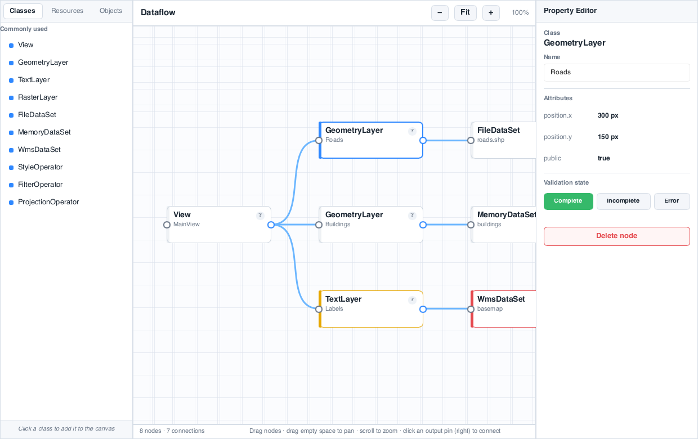

# node-editor-cpp

A small [Slint](https://slint.dev) node / dataflow editor in C++, modeled on
[Carmenta Studio](https://docs.carmenta.com/pages/studio.html): a horizontal
forest (root at left), state-coloured class nodes, and light-blue bezier
connector wires.



It exists to show that an interactive node editor is a build-it-yourself
component in Slint, not a fight-the-framework one. The whole thing is one
`.slint` UI file (~430 lines) plus ~120 lines of backend that only owns the
models — provided in both **C++** (`main.cpp`) and **Rust** (`main.rs`). The
same UI also compiles to **WebAssembly** for a browser demo.

## Features

- Bezier wires whose control points are **bound** to pin positions — no path
  strings, no per-frame redraw code (`node-editor.slint`, the `Path`/`CubicTo`)
- Pan (drag empty canvas) and zoom-to-cursor (scroll wheel)
- Drag nodes with wires following live
- Click an output pin, then an input pin, to connect
- Selection + a live property editor (rename, validation state, delete)
- Class palette to add nodes

## Build & run — C++

Needs CMake ≥ 3.21, a C++20 compiler, and — for the first configure, which
fetches and builds Slint — a [Rust toolchain](https://rustup.rs).

```sh
cmake -B build -S .
cmake --build build
./build/node-editor        # build/Debug/node-editor.exe on Windows
```

To use a pre-installed Slint C++ package instead of fetching it, point CMake at
it with `-DCMAKE_PREFIX_PATH=/path/to/slint`.

## Build & run — Rust

```sh
cargo run
```

## Build & run — WebAssembly (browser demo)

Slint has no C++→WASM path, so the browser build uses the Rust backend — the
UI and behaviour are identical.

```sh
wasm-pack build --release --target web   # -> ./pkg
python3 -m http.server 8777              # serve this folder
# open http://localhost:8777/index.html
```

`index.html` + `pkg/` is a fully static bundle; drop it on any static host.

## Layout

| File | |
|---|---|
| `node-editor.slint` | the UI — all drawing and interaction (shared) |
| `main.cpp` | C++ backend — `slint::VectorModel` + callbacks |
| `main.rs` | Rust backend — `VecModel` + callbacks (also the WASM entry) |
| `CMakeLists.txt` / `Cargo.toml` | C++ / Rust build |
| `index.html` | WASM host page |
| `preview.slint` | static wrapper for `slint-viewer --screenshot` (no backend) |

## How it maps to Slint

| Node-editor need | Slint primitive |
|---|---|
| Wires / curves | `Path` + `MoveTo`/`CubicTo`, control points as bound properties |
| Pan | one background `TouchArea` |
| Zoom | a single `zoom` factor applied at the canvas level |
| Drag | per-node `TouchArea` + `absolute-position` |
| Dynamic add/remove | host-owned `slint::VectorModel<T>` |

## License

MIT — see [LICENSE](LICENSE).
